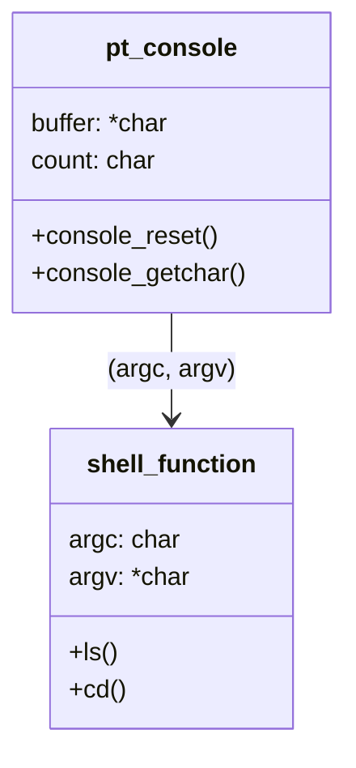

# rp2040
[FreeRTOS - 成大資工](https://wiki.csie.ncku.edu.tw/embedded/freertos)  
[Pico C/C++ SDK](https://www.waveshare.net/w/upload/5/5f/Pico_c_sdk.pdf)  
[Raspberry Pi Pico SDK Examples](https://github.com/raspberrypi/pico-examples)  
[SDK](https://datasheets.raspberrypi.com/pico/raspberry-pi-pico-c-sdk.pdf)  
[Hardware APIs](https://www.raspberrypi.com/documentation/pico-sdk/hardware.html)  
[RP2040(树莓派Pico)Examples](https://www.taterli.com/7504/)  
[Index](https://ece4760.github.io/)  
Use the development board as [RP2040-Zero](https://www.waveshare.net/wiki/RP2040-Zero).  
## CLI refer
1. https://github.com/Nrusher/nr_micro_shell
2. https://github.com/lurk101/pshell
3. https://gitee.com/somebug/atomlib
4. https://github.com/fapplin/rp2040-pico-command-line-interpreter
5. https://github.com/mattwach/pico_uart_console
6. 
7. https://github.com/RC2014Z80/picoterm 
8. https://github.com/JingoC/terminal
9. https://github.com/maxpoliak/ile-cli

## Let's start !!  
如果pico-sdk沒有submodule update，某些模組(tinyusb)沒安裝，會導致PC偵測不到rp2040  
```bash
git clone https://github.com/tim108108/rp2shell.git
git clone https://github.com/raspberrypi/pico-sdk.git
cd pico-sdk
git submodule update --init
cd ..
```
建立toolchain，pico-sdk位置固定在目錄最上層  
```bash
mkdir build
cd build
cmake ..
```
當要編譯時在build路徑下執行
```bash
rp2shell/build/make -j
```
接著把build目錄下的`rp2040_project.uf2`燒錄到rp2040

## Code struct
