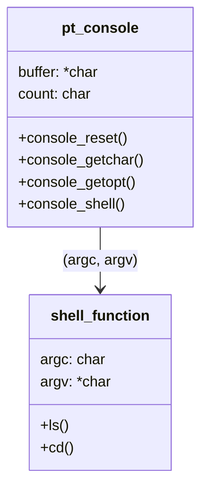
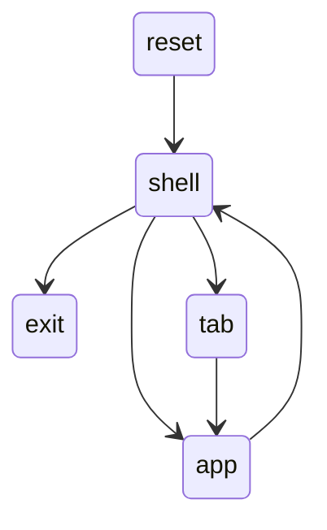

## Let's start !!  
如果pico-sdk沒有submodule update，某些模組(tinyusb)沒安裝，會導致PC偵測不到rp2040  
```bash
git clone https://github.com/tim108108/rp2shell.git
git clone https://github.com/raspberrypi/pico-sdk.git
cd pico-sdk
git submodule update --init
cd ..
```
建立toolchain，pico-sdk位置固定在目錄最上層  
```bash
mkdir build
cd build
cmake ..
```
當要編譯時在build路徑下執行
```bash
rp2shell/build/make -j
```
接著把build目錄下的`rp2040_project.uf2`燒錄到rp2040

## Code struct



